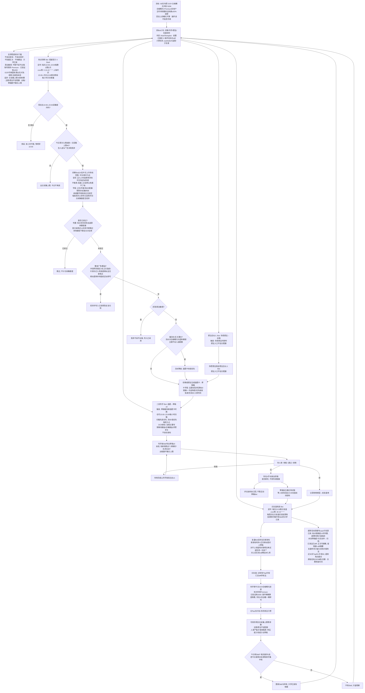
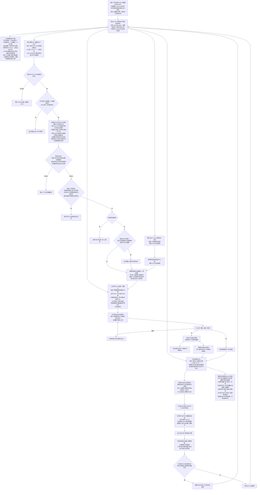

# X 运营流程图

> @QiangJia39245 · 90 天 OCR 500K · Asia/Shanghai

打开本页即可看图；改 `流程图.md` / 本 README 后合并进 `main`，刷新浏览器就更新。

备用静态预览：

```mermaid
flowchart TD
  GOAL["目标: 90天内把 OCR 合格曝光冲到 500K<br/>合格曝光=Premium系用户主时间线看到且帖面≥50%进屏<br/>回复上的曝光不算 · 插件读不到须手填"]
  GOAL --> TEAM["四Bot小队: 侦察/写手/想法/复盘协同<br/>时区 Asia/Shanghai · 前置已授权 X 插件拉帖与diff<br/>介质优先 vault/wiki/X运营/ 子目录"]

  TEAM --> BASE["全流程底线与门槛<br/>不自动发帖 · 不自动回评 · 不批量互关 · 不纯搬运 · 只学已发<br/>政治敏感: 不聊不采不出稿<br/>账号保持 Premium · 已验证粉≥500<br/>OCR可用国有港台无大陆: 收款/注册地自核<br/>起步: 日采集上限40防刷爆 · 主题/想法不设配额 · 出稿/草稿数不做日上限"]

  TEAM --> SCOUT["热点侦察 Bot: 借鉴官方 X Brief<br/>定时: 每天10:00–23:00每整点跑1次<br/>cron例: 5 10-22 * * * 上海时区<br/>23:00–次日10:00夜间停采<br/>每小时只扫增量"]
  TEAM --> WRITER["二创写手 Bot: 选题→草稿 v0<br/>触发: 草稿箱有新选题卡时跑<br/>也可10:00–23:00每小时扫箱<br/>扫箱先高优先, 浇水/低优先每轮少占<br/>OCR原创: 加观点重写<br/>禁微改搬运/合集搬运/求赞求关<br/>不自动发帖"]
  TEAM --> IDEAS["想法合伙人 Bot: 你丢想法→出稿<br/>触发: 你丢想法时即时<br/>想法入口不设日配额"]
  TEAM --> RETRO["日复盘改进 Bot<br/>定时: 每天23:30跑日复盘<br/>cron例: 30 23 * * *<br/>每周日在日复盘后加加深档<br/>加深档可集中改Skill仍只学已发"]

  SCOUT --> WIN{"现在在10:00–23:00采集窗内吗?"}
  WIN -->|否 夜间| SKIP["停采: 本小时不跑, 等明早10:00"]
  WIN -->|是| CAP{"今日首次入库条数 < 日采集上限40?<br/>含入选与广告涉政丢弃"}
  CAP -->|否| SKIP2["达日采集上限, 今日不再采"]
  CAP -->|是| PULL["侦察Bot从X拉中文上升热帖<br/>范围: 中文/简中为主<br/>信号: 近几小时高赞转评的中文帖近似热度<br/>不做真·涨速二点采样以免落不了地<br/>字段: 正文/作者/帖ID/链接/赞转评/采集时间<br/>阅读数字段有则记无则空<br/>每条首次入库写已采库并扣日采集额度含丢弃"]
  PULL --> DEDUP{"是否已采过?<br/>判重: 帖ID优先否则去追踪参数链接<br/>查已采库近14天命中即跳过<br/>本地键查不靠全文对全库"}
  DEDUP -->|已采过| SKIPD["跳过, 不计日采集额度"]
  DEDUP -->|未采过| ADS{"像纯广告/搬运?<br/>外链带货套话 或 正文指纹/片段与已入库高度相似且无新观点<br/>相似度用本地指纹近似即可"}
  ADS -->|是| SKIPA["丢弃并写入已采库防反复扫到"]
  ADS -->|否| POL{"涉政/政治敏感?"}
  POL -->|是| SKIPP["丢弃不采不出稿, 写入已采库"]
  POL -->|否| WATER{"偏浇水/互关灌水?<br/>浇水对合格曝光与蓝粉都弱<br/>主题不设入选配额"}
  WATER -->|是| DEMOTE["浇水降级: 选题卡标低优先"]
  WATER -->|否| CARD["侦察或想法生成选题卡→草稿箱<br/>卡字段: 主题标签/来源帖ID链接/一句话角度/优先级高低/是否浇水/入库时间"]
  DEMOTE --> CARD

  IDEAS --> IDEA["你把想法丢给想法合伙人 Bot<br/>想法入口不设日配额"]
  IDEA --> CARD

  CARD --> WRITER
  WRITER --> DRAFT["写手按Skill写出草稿v0<br/>自检: 有新增观点? 非微改? 无求互动?<br/>出稿数不做日上限"]
  DRAFT --> HUMAN["你人审: 改稿 / 通过 / 拒绝"]
  HUMAN -->|改稿| EDIT["你改完或让写手按批注出v1"]
  EDIT --> DRAFT
  HUMAN -->|拒| REJ["记录拒绝原因→给复盘用"]
  HUMAN -->|过| POST["你在X手动发出终稿<br/>发完即完, 不用写回链接"]
  POST --> REPLY["评论由你自己回, 不跑互动草稿Bot"]
  POST --> WAIT["草稿标已通过待对账<br/>等人发完后由23:30复盘自动挂帖"]

  WAIT --> RETRO
  REJ --> RETRO
  RETRO --> MATCH["复盘Bot拉你当日新发帖<br/>按发帖时间+正文相似度对上草稿<br/>对不上则留待对账明日再试或你丢一句发了<br/>对上后实发vs原稿diff入库"]
  MATCH --> DAY["日复盘: 过审率/Top/扑街<br/>汇总diff学改法"]
  RETRO --> CLEAN["顺带空间清理写vault子目录<br/>已采: 帖ID链接留14天判重, 超期归档只留指纹<br/>未发草稿超7天无动作→归档<br/>已发且已diff: 正文可缩略, 留链接+diff摘要<br/>复盘样本只留已发有价值改法<br/>近30天Top50+扑街50, 超则淘汰最旧<br/>原始拉帖JSON超3天删 · 日报告留90天"]
  DAY --> OCR["你手填今日OCR合格曝光进度<br/>核对仍持Premium<br/>已验证粉≥500: 插件难精算蓝粉数, 你在X后台瞄一眼即可"]
  OCR --> TOP["记Top与扑街+你的改法习惯"]
  TOP --> QUOTA["可改写明日日采集上限等参数<br/>主题/想法不设配额<br/>人审产能才是真瓶颈: 积压就少采或少出草稿"]
  QUOTA --> SKILL{"今日改Skill? 每天最多1处<br/>若今日是周日加深档则可集中改"}
  SKILL -->|是| UPD["更新Skill与样本, 只学已发有依据"]
  SKILL -->|否| OBS["不改Skill, 只留观察"]
  UPD --> TEAM
  OBS --> TEAM
  BASE -.-> TEAM
```
